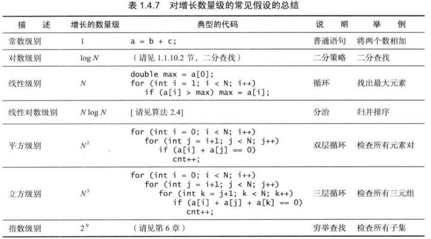

# 常见排序算法 & 数据结构
## 目录

1. 时间复杂度、空间复杂度
2. 常见排序算法
3. 常见数据结构
4. 几个题目练练手

## 时间复杂度 O(f(n))
* 问题规模 n

算法输入的参数

* 时间频度 T(n)

一个算法中的语句执行次数称为语句频度或时间频度

1. 一个算法执行所耗费的时间，从理论上是不能算出来的，必须上机运行测试才能知道。
2. 但我们不可能也没有必要对每个算法都上机测试，只需知道哪个算法花费的时间多，哪个算法花费的时间少就可以了。


* O表示法

若有某个辅助函数f(n), 使得

```
T(n) = f(n) * k
// n趋近于无穷大，k为不等于0的常数值
```

则称f(n)是T(n)的同数量级函数，记作：
```
T(n) = O(f(n))
```
以最坏的情况考虑

常见的时间复杂度:

